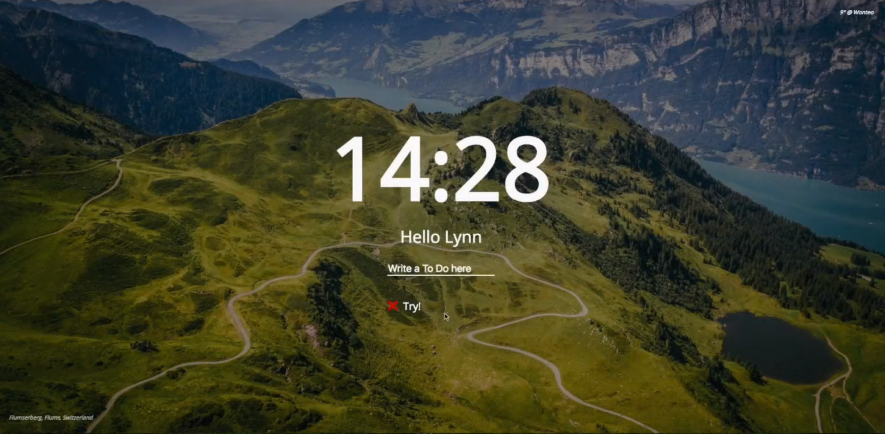
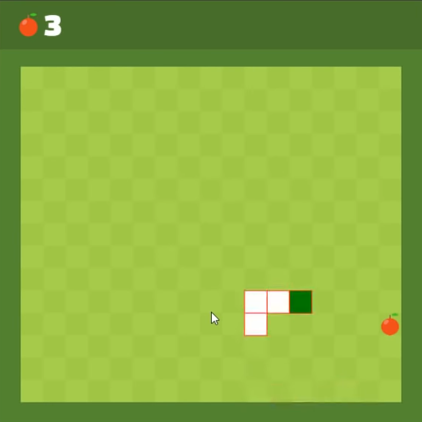

# Javascript
* [프론트엔드반] - 이승준 선생님
* 8월 17일부터 시작(수강생들과 일정 조율)

 

## 📕 배우는 것들
1. Javascript 기초
2. Javascript 활용한 프로젝트(<a href="https://nomadcoders.co/javascript-for-beginners">참고1</a>, <a href="https://nomadcoders.co/javascript-for-beginners-2">참고2</a>, <a href="https://youtu.be/9TcU2C1AACw">참고3</a>)

 

## 😎 배우고 나면
* 바닐라 JS로 크롬 앱 만들기

* 바닐라 JS로 그림판 만들기

* 바닐라 JS로 뱀게임 만들기

 

## 📕 먼저 배울것
* HTML, CSS 기초

 

## 😈 학습 난이도
진도가 빠를 수 있으므로 예습, 복습은 필수!

 

## 😀 학습 방법
영상 강의로 먼저 학습 후 세션 참여, 세션에서 중요한 내용 짚어가며 복습, 퀴즈

 

## 😌 과제  
강의 보며 만든 프로젝트 깃허브 커밋 필수, 추가 사항은 수강생과 조율
